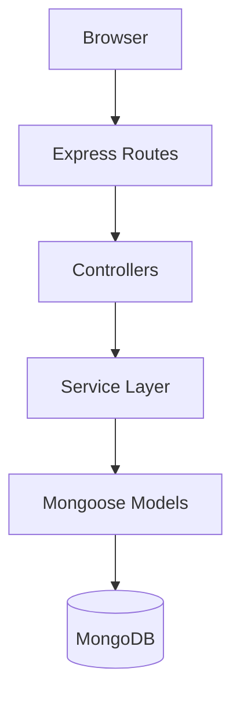

# ⏱️ TimeCraft

> **Craft your time. Master your productivity.**


## 📌 About The Project

**TimeCraft** is a full-stack time and productivity management web application built using **Node.js, Express, MongoDB, and EJS**.

This project is designed with an **interview and real-world application mindset**, strictly avoiding "tutorial hell" patterns. It demonstrates:
* Clean MVC architecture
* Scalable backend structure
* Role-based access control
* Secure session handling

> 💡 **Note:** This is not just a tutorial project — it reflects how real production-level Node.js applications are structured.

---

## 🚀 Features

* **🔐 User Authentication & Session Management:** Secure login/signup flows.
* **👥 Role-Based Access Control (RBAC):** Distinct permissions for **Admins** and **Users**.
* **🗂️ Task & Time Management:** Create, update, and track daily tasks.
* **📊 Structured Dashboard Flow:** Intuitive data visualization.
* **🧩 MVC Architecture:** Separation of concerns for maintainability.
* **🛡️ Centralized Error Handling:** Robust error management logic.
* **📱 Fully Responsive UI:** Optimized for Desktop, Tablet, and Mobile via Tailwind CSS.
* **🧪 Clean Code:** Linted and formatted using **ESLint**.

---

## 🛠️ Tech Stack

### Frontend
*  **HTML5**
*  **Tailwind CSS**
*  **JavaScript (ES6+)**
* **EJS** (Templating Engine)

### Backend
*  **Node.js**
*  **Express.js**
*  **MongoDB**
* **Mongoose** (ODM)

### Tools & Utilities
* **ESLint** (Linting)
* **Multer** (File Uploads)
* **WebSockets** (Real-time updates)
* **MongoDB Compass**

---

## 🧱 Architecture Overview

TimeCraft follows a strict Model-View-Controller (MVC) pattern to ensure scalability.




## 📂 Project Structure

```bash
TimeCraft/
│
├── .vscode/              # VS Code settings
├── app/
│   ├── config/           # Configuration files
│   ├── constants/        # Global constants
│   ├── controllers/      # Request handlers
│   ├── database/         # DB connection logic
│   ├── helpers/          # Utility functions
│   ├── middleware/       # Auth & error middleware
│   ├── models/           # Mongoose Schemas
│   ├── routes/           # Route definitions
│   └── service/          # Business Logic (User/Admin)
│
├── logs/                 # Error and access logs
├── public/               # Static assets (CSS, JS, Images)
├── views/                # EJS Templates
│   ├── admin/
│   ├── layouts/
│   ├── partials/
│   └── user/
│
├── .env                  # Environment variables
├── eslint.config.js      # Linter configuration
├── server.js             # Application Entry Point
└── package.json
```

---

## ⚙️ Getting Started

Follow these steps to set up the project locally on your machine.

## Prerequisites

Make sure you have the following installed:

* **Node.js** (v14+)
* **npm**
* **MongoDB** (running locally or a cloud URI)
* **Git** 

## Installation

**1. Clone the repository**
```bash
git clone https://github.com/Loopzero700/TimeCraft_v-0.01.git timecraft
```

**2. Enter the folder**
```bash
cd timecraft
```
**3. Install dependencies**
```bash
npm install
```
**4. Set up Environment Variables** Create a **.env** file in the root directory and add the
following keys:

```bash
PORT=5000
MONGODB_URL=mongodb://localhost:27017/TimeCraft_v001
SESSION_SECRET=your_super_secret_key_here
NODEMAILER_PASS=your_email_password
NODEMAILER_EMAIL=your_email_address
GOOGLE_CLIENT_ID=your_google_id
GOOGLE_CLIENT_SECRET=your_google_secret
CLOUDINARY_CLOUD_NAME=your_cloud_name
CLOUDINARY_API_KEY=your_api_key
CLOUDINARY_API_SECRET=your_api_secret
RZP_KEY_ID=your_razorpay_id
RZP_SECRET=your_razorpay_secret
SESSION_MAXAGE_USER=86400000
```
**5. Start the server**
```bash
npm start
```
**6. Start the server**
**Access the App Open** your browser and go to: http://localhost:5000

---


## 👨‍💻 Author
**Prasanth**

* Backend / Full-Stack Developer

* Focused on building clean and scalable web applications

---

# ⭐ Support
**If you like this project, give it a ⭐ on GitHub!**


